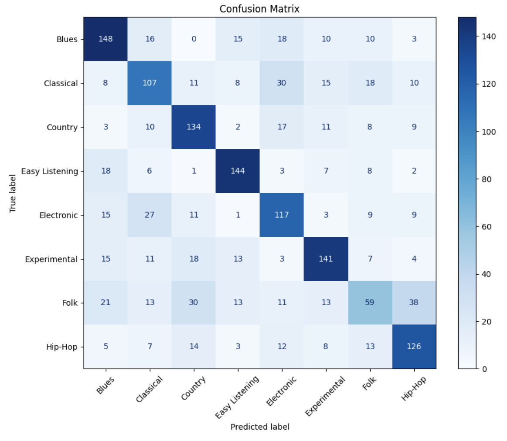

# 🎵 Techniques & Methods Used in HarmoniaNet (Updated: FMA + CNN Approach)

---

## 📁 Dataset: FMA (Free Music Archive)

- Used the **FMA-small subset**, which includes 8,000 `.mp3` tracks.
- Parsed metadata from `tracks.csv` and selected only entries with a **top-level genre**.
- Filtered to keep only tracks with both audio and valid genre labels.
- **Final usable tracks**: ~7,000
- **Genres used**: 16 top-level genres including Blues, Classical, Hip-Hop, Experimental, Electronic, Jazz, Rock, etc.

---

## 🎚️ Audio Preprocessing: Mel Spectrograms

- Each audio file was converted into a **128-band mel spectrogram** using `librosa`.
- Converted spectrograms to decibel scale with:
  - Sample rate: 22050 Hz
  - Duration: 30 seconds
  - Output size: (128, 1280) matrix per track
- Padded or truncated to ensure fixed width.
- Stored locally as `.npy` files in a `mel_spectrograms/` directory for fast access during training.

---

## 🧱 Model Architecture: Convolutional Neural Network (`GenreCNN`)

- Input: 2D Mel spectrogram with shape (1, 128, 1280)
- CNN structure:

  - Conv2d → BatchNorm → ReLU → MaxPool
  - Conv2d → BatchNorm → ReLU → MaxPool
  - Conv2d → BatchNorm → ReLU → AdaptiveAvgPool2d (4×4)
  - Flatten → Linear(1024 → 128) → ReLU → Dropout(0.3) → Linear(128 → 16)

- Final output layer has **16 neurons**, one for each genre class.

---

## ⚙️ Training Configuration

- **Loss Function**: CrossEntropyLoss (for multi-class classification)
- **Optimizer**: Adam (learning rate = 0.001)
- **Scheduler**: StepLR (step size = 20 epochs, gamma = 0.5)
- **Epochs**: 100
- **Device**: CUDA-enabled GPU via Google Colab
- **Batch Size**: 32
- Model checkpoint saved as `harmonianet.pth`

---

## 📉 Training Progress

- Training loss was recorded across all epochs.
- Visualized training curve using `matplotlib` to ensure convergence and stability.

---

## 🧪 Evaluation & Results

- Evaluated on a held-out validation set using accuracy and confusion matrix.
- **Validation Accuracy**: **61.00%**

### Confusion Matrix

- Strong genre separation was observed for classes like **Classical**, **Electronic**, and **Hip-Hop**.
- Some genre confusion appeared between related styles (e.g., Folk vs. Country, Rock vs. Experimental).

---

## 📦 Export & Deployment

- Final model and spectrogram dataset zipped into `harmonianet_outputs.zip`.
- Downloaded via Colab or backed up to Google Drive.
- Model is now integrated into the HarmoniaNet backend using FastAPI for real-time predictions.

---

## 📤 Next Steps

- Continue collecting genre feedback through the frontend Google Form.
- Use labeled corrections to fine-tune the model or retrain on difficult genres.
- Experiment with deeper CNNs or alternative spectrogram augmentations to improve classification performance.
